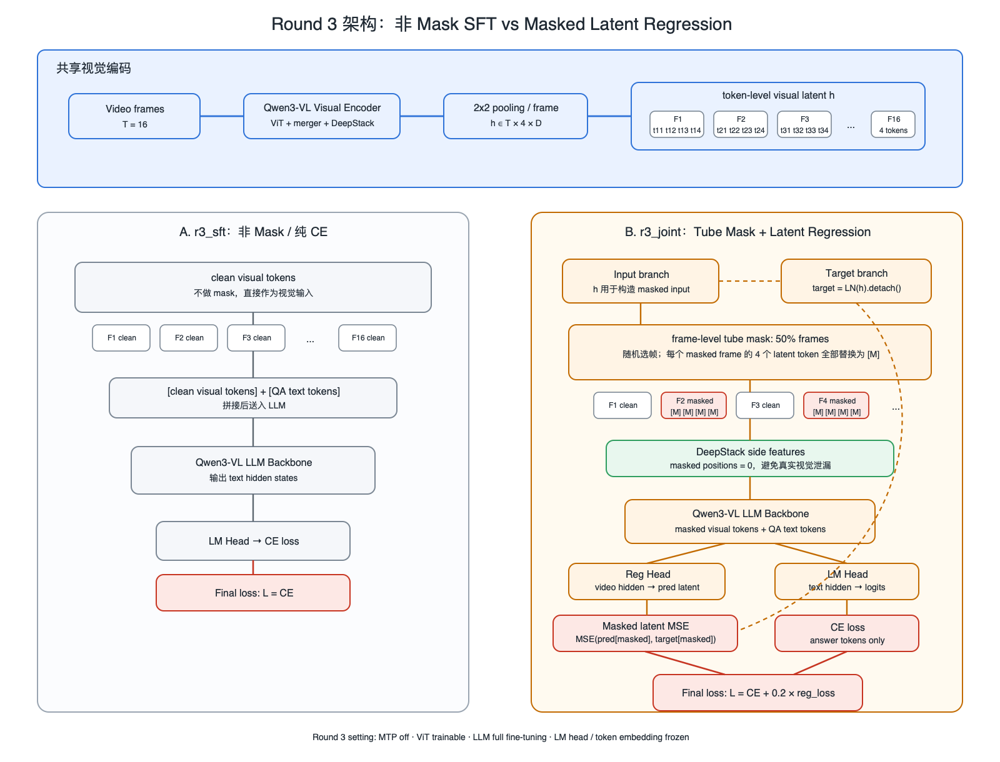
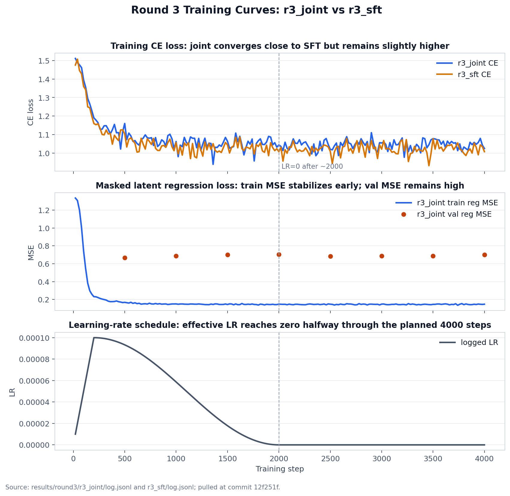

# Round 3 实验记录简述（2026-07-08）

## 1. 实验目的

本轮对比两个训练方案，验证 **masked latent regression** 是否能提升视频时序理解：

| 实验臂 | 输入方式 | 训练目标 |
|---|---|---|
| `r3_sft` | clean visual latent | `CE` |
| `r3_joint` | 50% frame-level tube mask | `CE + 0.2 * reg_loss` |

## 2. 架构图

*Figure 1. Round 3 中非 mask SFT 与 masked latent regression 的 token 级训练流程。*

核心流程：

- 两个实验臂共享视觉编码：`Video frames -> Qwen3-VL Visual Encoder -> 2x2 pooling -> h ∈ T x 4 x D`。
- `r3_sft`：不做 mask，直接把 clean visual tokens 与 QA text tokens 输入 LLM，只计算 answer tokens 的 CE。
- `r3_joint`：从 `h` 构造两条分支：`target = LN(h).detach()` 作为回归目标；input branch 做 frame-level tube mask 后送入 LLM。
- mask 是按帧做的：被选中的 frame 中，4 个 latent tokens 全部替换成 learnable `[M]`；DeepStack 对应 masked positions 置 0，避免真实视觉特征泄漏。
- `reg_loss = MSE(pred[masked], target[masked])`，最终 `L = CE + 0.2 * reg_loss`。

## 3. 训练设置

| 项目 | 设置 |
|---|---|
| 基座模型 | Qwen3-VL-2B-Instruct |
| 输入帧数 | 16 |
| 每帧 latent tokens | 4 |
| mask ratio | 50% frames |
| reg 权重 | 0.2 |
| MTP | off |
| ViT | trainable |
| LLM | full fine-tuning |
| LM head / token embedding | frozen |
| max steps | 4000 |
| 数据 | LLaVA-Video QA flow-filtered manifest |
| temporal QA mix | 30% shuffle / reverse yes-no QA |

## 4. 评测结果

Held-out temporal QA：

| arm | overall | none | shuffle | reverse |
|---|---:|---:|---:|---:|
| `r3_joint` | 50.10 | 81.40 | 19.17 | 18.18 |
| `r3_sft` | 49.07 | 92.98 | 4.17 | 5.79 |

Public MCQ：

| Benchmark | joint | sft | Δ |
|---|---:|---:|---:|
| MVBench | 49.59 | 49.56 | +0.03 |
| TempCompass | 57.78 | 58.16 | -0.38 |

## 5. Loss 图

## 6. 简短结论

本轮实验不是单纯加 MSE，而是 **mask 输入 + latent 回归目标 + CE** 的联合训练。结果上，`r3_joint` 在自建 temporal QA 的 shuffle / reverse 上更敏感，但整体提升只有 `+1.03pp`，且在 MVBench / TempCompass 上基本没有稳定正收益。当前 50% mask 可能偏强，后续更值得尝试较低 mask ratio 或 clean CE + masked reg 的双视图训练。
